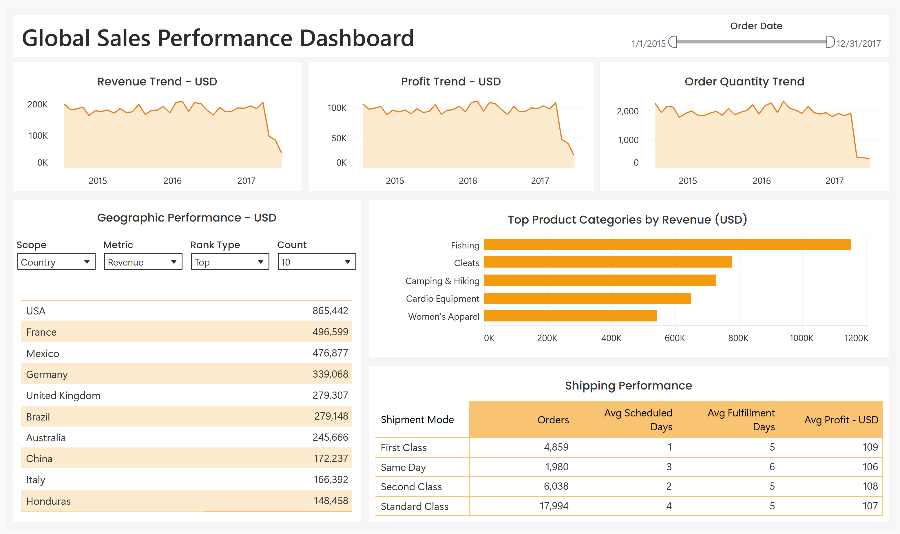

# Global Sales Performance Analysis (2015–2017)

Interactive Tableau dashboard analyzing global revenue trends, product performance, geographic sales distribution, and shipping efficiency to investigate patterns behind a late-period decline in sales activity.

## Tools
- Tableau
- Data Visualization
- Exploratory Data Analysis

---

# Business Problem

A global retail company observed a noticeable decline in revenue and profitability near the end of the reporting period. Leadership wanted to determine whether this decline was caused by falling demand, geographic shifts in sales activity, product category performance, or operational factors such as shipping efficiency.

The goal of this analysis was to explore internal sales patterns and identify potential structural risks within the company’s revenue generation.

---

# Key Questions

1. How have revenue, profit, and order volume changed over time?
2. Which regions and countries generate the most revenue?
3. Which product categories contribute the most to sales?
4. Does shipping method affect delivery time or profitability?

---

# Key Insights

**Interactive dashboard:**  
View the full interactive version on Tableau Public: https://public.tableau.com/app/profile/maunga.m1851/viz/SalesPerformance_17730508571460/Dashboard

### Decline in Sales Is Driven by Falling Order Volume

Revenue, profit, and order quantity follow nearly identical trajectories throughout the analysis period, indicating that margins remain relatively stable.

However, between September 2017 and October 2017, revenue declined by more than 50%, profit dropped by a similar rate, and order volume fell by over 80%. Because these metrics move together, the decline is most consistent with a drop in purchasing activity rather than changes in pricing or cost structure.

---

### Revenue Is Concentrated in a Few Geographic Markets

The highest revenue levels are generated by a small group of regions, particularly Latin America and Europe. When drilling down to the country level, these regions continue to dominate sales performance.

Lower-performing markets contribute significantly smaller volumes, indicating that global revenue distribution is uneven and concentrated in a limited number of markets.

---

### Product Revenue Is Skewed Toward a Small Number of Categories

Fishing-related products generate substantially more revenue than other categories, suggesting strong demand in this segment.

Other product categories contribute meaningful revenue but at much lower levels. This indicates the company’s product portfolio is not evenly balanced and that overall performance relies heavily on a few core product groups.

---

### Shipping Performance Is Operationally Consistent

Average scheduled shipping times range from one to four days depending on the delivery method, but actual fulfillment times remain close to five days across all shipping modes.

Profit per shipment is also relatively similar regardless of delivery speed, indicating that shipping method has little impact on overall profitability.

---

# Business Implications

- Sales performance appears highly dependent on order volume rather than pricing or margin changes. As a result, sustaining revenue growth likely requires increasing customer demand and transaction frequency rather than adjusting pricing.
- Revenue concentration in a limited number of geographic markets exposes the company to regional demand fluctuations.
- Dependence on a small number of product categories creates portfolio risk if demand in those segments weakens.
- Operational consistency across shipping modes suggests that logistics processes are stable but may offer limited opportunity for margin improvement through shipping strategy alone.

---

# Recommendations

- Expand marketing and sales initiatives in underperforming regions to diversify revenue sources.
- Invest in product development and promotion for mid-performing product categories to reduce reliance on fishing-related products.
- Focus growth initiatives on increasing order volume through targeted marketing campaigns or channel expansion.
- Conduct additional analysis incorporating seasonality and external market data to better understand the sharp decline observed late in the reporting period.

